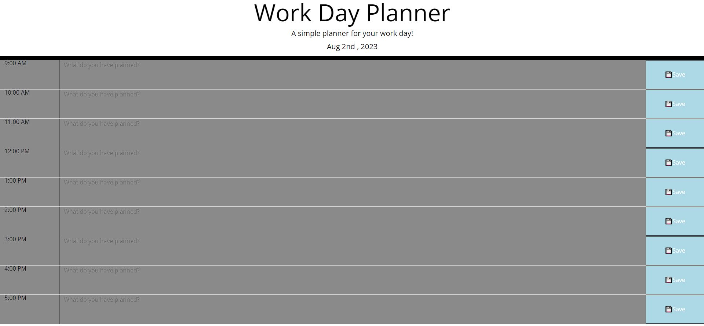

# Work Day Planner

A simple calendar app for planning your day

### URL : 

Github: https://github.com/Anthonykahly/workday-planner
Pages: https://anthonykahly.github.io/workday-planner/ 

## Description

```
This simple calender allows the user to plan their day. 
This planner will dynamically update throughout the day. 
```

## User Story

```
- AS AN employee with a busy schedule
- I WANT to add important events to a daily planner
- SO THAT I can manage my time effectively
```

## Acceptance Criteria

```
- GIVEN I am using a daily planner to create a schedule
- WHEN I open the planner
- THEN the current day is displayed at the top of the calendar
- WHEN I scroll down
- THEN I am presented with time blocks for standard business hours
- WHEN I view the time blocks for that day
- THEN each time block is color-coded to indicate whether it is in the past, present, or future
- WHEN I click into a time block
- THEN I can enter an event
- WHEN I click the save button for that time block
- THEN the text for that event is saved in local storage
- WHEN I refresh the page
- THEN the saved events persist
``` 

## Usage

```
- Planner will display times between 9am-5pm
- The top of the page will display the current date and time for planning
- Each time block will be properly color coded for quick visual indication of availability
- Each line will contact a text box for user input as well as a save button to locally store plans.
```
## Images

 

